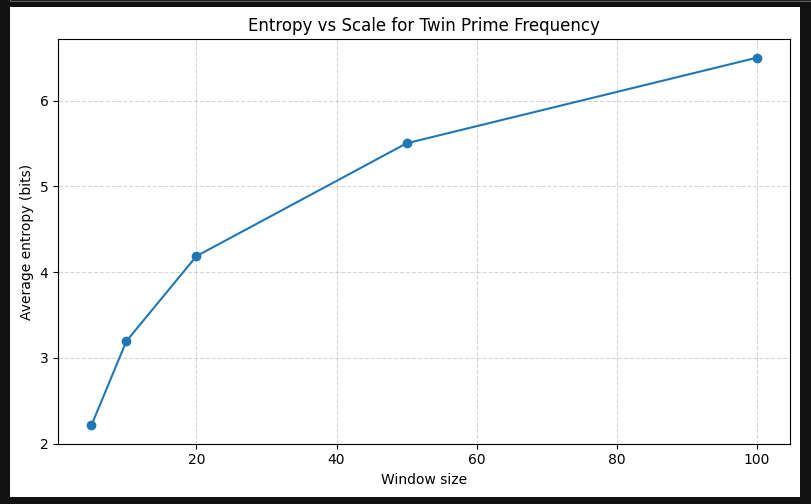
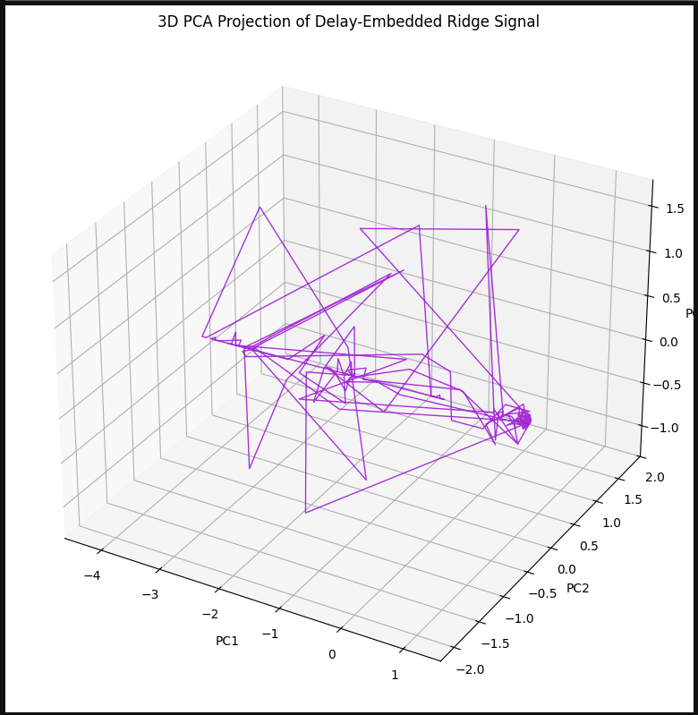
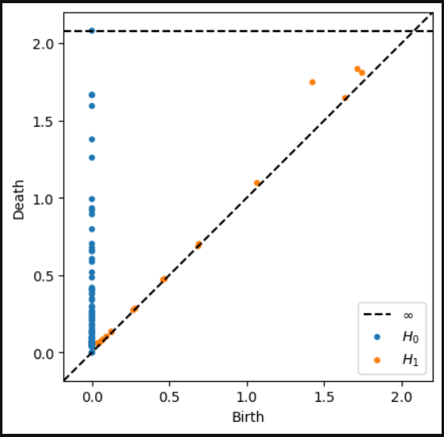

# Topological Signatures in the Entropy of Twin Primes

This project explores the distribution of **twin primes** through the lens of **information theory** and **topological data analysis (TDA)**.

We treat the twin prime distribution as a time series and compute local **Shannon entropy** over sliding windows. By applying **delay embeddings** and **persistent homology**, we uncover subtle, long-lived topological features—indicative of recurring structure in the entropy dynamics of twin primes.

---

## 🔍 Key Ideas

- **Entropy as Structure Detector:** Compute local entropy from twin prime counts in fixed-width bins.
- **Wavelets + Delay Embedding:** Extract dominant oscillatory modes and reconstruct their phase space.
- **Persistent Homology:** Detect topologically significant loops (H₁ features) in embedded entropy trajectories.
- **Shuffled Controls:** Compare with randomized data to establish statistical significance.

---

## 🧠 Why It Matters

Twin primes appear random, but their entropy dynamics suggest moments of **quasi-cyclic structure**. Our topological approach makes this structure visible—offering a new lens on classical number-theoretic questions.

---

## 📊 Visual Highlights

| Entropy Signal | Ridge Loop | Persistence Diagram |
|----------------|------------|---------------------|
|  |  |  |

Additional plots explore wavelets, FFTs, entropy distributions, and more—see the `images/` folder for a full visual tour.

---

## 📂 Files

- `Twin_Primes_InfoTheory.ipynb` – Full analysis pipeline  
- `images/` – All figures used in the analysis  
- `Twin_Primes_Entropy2_safe.pdf` – Companion paper (recommended read!)

---

## 🌱 Next Steps

We’re extending this approach to other prime constellations, starting with **Germain primes**. Stay tuned for a general-purpose toolkit for topological analysis of prime distributions.

---

## 🧙‍♂️ Author

**CRL-J**  
This work is part of an ongoing exploration of the deep structure within arithmetic through the eyes of entropy, topology, and intuition.

> *“The primes are not silent. We just haven't learned how to listen.”*

---

## 📖 References

See the full paper for detailed citations and theoretical background:  
[`Twin_Primes_Entropy2_safe.pdf`](Twin_Primes_Entropy2_safe.pdf)
